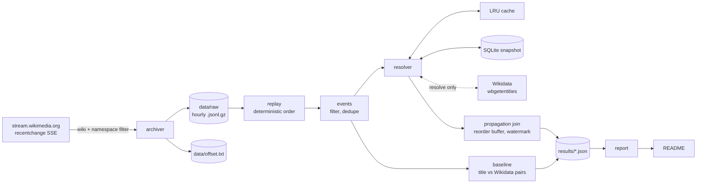

# WikipediaLagChecker

[](https://github.com/lawgalyadel/WikipediaLagChecker/actions/workflows/ci.yml)

WikipediaLagChecker measures how long it takes for an edit about a subject to
spread from one Wikipedia language edition to the next. I take edits from
Wikimedia's live `recentchange` stream and match pages in different languages
through the Wikidata item they share (e.g. the English and French articles on
the same person both link to one Wikidata item).

## Status

Every part of the pipeline is built and tested: archiving, entity resolution,
the title-match baseline, the propagation join, benchmarking, failure analysis
and the report. The numbers below come from an archive that is only a few hours
long so far, so there are three things I still need to finish.

The first is the propagation lag numbers. These need more than 12 hours of
continuous archive (a 6h watermark plus a 6h warm-up), and until then the join
outputs nothing rather than numbers from windows it only saw part of. The
second is precision and recall, which need me to label the 200 pairs in
`labels/pairs.csv` by hand. The third is the failure table, which needs me to
go through the review sheet from `python -m WikipediaLagChecker failures sample`.

## Results

This section is generated by `python -m WikipediaLagChecker report` from the
files in `results/`, which are written by the commands further down. Anything I
haven't run yet shows the command that produces it instead of a number.

<!-- results:start -->

### Data

|  | Value |
|---|---|
| Archive window (event time, UTC) | 2026-09-13T14:58 → 2026-09-13T18:59 (5 hourly partitions) |
| Raw events archived | 60,072 |
| Undecodable archive lines | 0 (0.0000%) |
| Damaged gzip members recovered | 1 |
| Coverage gaps | 1 gap, 1 minute; largest: 1 min from 15:00 UTC 2026-09-13 |
| Article edits after filtering | 54,965 |
| Duplicates removed (restart re-archiving) | 66 |
| Filtered out | type:log 5,041 |

### Entity resolution

|  | Value |
|---|---|
| Edits resolved to a Wikidata item | 94.6% of 54,965 |
| **LRU cache hit rate** | **14.5%** (7,961 of 54,965 lookups; 545 were negative hits) |
| Coalesced within a block (repeat of a pending key) | 13.3% (7,303) |
| Served from the snapshot | 39,284 |
| Wikidata requests in this run | 21 batched requests for 417 titles |
| Request latency p50 / p95 | 288.4 ms / 694.6 ms |
| Rate limited / retries / failed titles / API errors | 0 / 0 / 0 / 0 |
| Cache capacity / evictions | 50,000 / 0 |

Hit rate counts only the in-memory LRU. Keys first seen in the same block are merged into one lookup and counted separately as coalesced.

### Baseline: title matching vs Wikidata

|  | Title match (naive) | Wikidata sitelinks |
|---|---|---|
| Cross-edition pairs found | 678 | 1,886 |
| Precision | _pending (run `python -m WikipediaLagChecker pairs evaluate`)_ (needs labels) | _pending (run `python -m WikipediaLagChecker pairs evaluate`)_ (needs labels) |
| Pooled recall (upper bound) | _pending (run `python -m WikipediaLagChecker pairs evaluate`)_ (needs labels) | _pending (run `python -m WikipediaLagChecker pairs evaluate`)_ (needs labels) |

Over 28,553 edited pages (95.3% with an item). Found by both: 666; title match only: 12; Wikidata only: 1,220.

**True pairs title matching misses:** 1,220 pairs are found only by Wikidata. How many are real won't be known until the sample is labelled.

Labels: 0 of 200 sampled pairs (stratified 94 / 12 / 94, seed 20260913), blind sheet in `labels/pairs.csv`.

### Propagation

No propagation numbers yet. Every window either opened during warm-up or was still open when the archive ended. The first results need more than 12h 00m of continuous archive.

Watermark 6h 00m, warm-up 6h 00m, reorder buffer 2m 00s. Windows opened: 36,444; excluded by warm-up: 36,444; still open at the end: 36,444.

### Performance

Replay of 5 partitions, median of 3 runs, on 10 physical / 12 logical cores. Output identical at every worker count: yes. Peak RSS under replay: **285.1 MB** (main process plus workers).

| Stage | Workers | Events/s | Speed-up | Efficiency | Peak RSS |
|---|---|---|---|---|---|
| full pipeline | 1 | 13,232 | 1.00× | 100% | 94.2 MB |
| full pipeline | 2 | 20,644 | 1.56× | 78% | 195.6 MB |
| full pipeline | 4 | 22,180 | 1.68× | 42% | 285.1 MB |
| parse only | 1 | 33,465 | 1.00× | 100% | 59.8 MB |
| parse only | 2 | 28,423 | 0.85× | 42% | 163.1 MB |
| parse only | 4 | 40,539 | 1.21× | 30% | 263.7 MB |

#### Profiled bottleneck: before and after

| Workers | Before (events/s) | After (events/s) | Gain | Scaling vs 1 worker |
|---|---|---|---|---|
| 1 | 5,986 | 13,232 | 2.21× | 1.00× → 1.00× |
| 2 | 7,067 | 20,644 | 2.92× | 1.18× → 1.56× |
| 4 | 7,088 | 22,180 | 3.13× | 1.18× → 1.68× |

Profile before: `~:0(<method 'execute' of 'sqlite3.Connection' objects>)` took 44.4% of a 11s profiled replay (39,702 calls). After: the top entry is `decoder.py:351(raw_decode)` at 21.2%, and the profiled replay takes 4s.

### Failure analysis

_pending (run `python -m WikipediaLagChecker failures sample`)_

<sub>Generated by `python -m WikipediaLagChecker report` from `results/*.json`. Runs: `archive` (b4598ce180e7), `resolve` (28bfcb037fe9), `pairs` (24aae2c8cca0), `propagation` (4efff4c8f63f), `bench_before` (5fd9fad6db57), `bench_after` (1064e2f0a5ae), `profile_before` (ca7fb1e27b57), `profile_after` (37d6c47bed2d).</sub>

<!-- results:end -->

## How it works



The archiver (`archiver.py`) does as little as possible. It drops wikis and
namespaces that aren't in the config and writes the raw payloads straight to
hourly gzip files. I kept all the parsing for later, because a parsing bug at
capture time would lose data for good, whereas the same bug at analysis time
only costs a replay.

From there, `replay.py` reads the partitions back in sorted order and
`events.py` turns the raw payloads into typed edits -- it's the only place the
payloads get interpreted. `resolver.py` then maps each `(wiki, title)` to a
Wikidata item by checking an in-memory LRU cache first, then a SQLite snapshot,
and only then sending batched API requests. Finally, `propagation.py` opens a
window on an item's first edit, records when the 2nd, 3rd and 5th editions show
up, and closes the window at the watermark.

## Design decisions

The first thing I had to get right was when the stream offset gets saved. Gzip
buffers its output in memory, so if the offset got ahead of the data that was
actually flushed, a crash would lose those events and the resume would skip
straight past them. I made the offset save only after a flush, which means a
hard kill re-archives up to `flush_every_events` events instead, and
deduplication on `meta.id` removes the repeats.

I also decided that replays should read a resolution snapshot rather than call
Wikidata. Wikidata changes over time, so resolving live would make my results
depend on the day I ran them. `resolve` fetches missing keys into SQLite, every
analysis reads that snapshot offline, and the same archive always gives the
same output. About 5% of edited pages have no Wikidata item, so I cache "no
item" results as well. Without this, every edit to one of those pages would
cost a request.

Edits can arrive up to ~50s out of order, which meant I couldn't trust arrival
order. A reorder buffer puts them back in edit-time order, and anything later
than the buffer allows is counted as out of order. Windows that open near the
start of the archive may have had earlier edits that were never captured, so
their leader can't be known. I leave these warm-up windows out -- they produce
no records, but I still count them. A late follow-up also doesn't reopen a
window, because otherwise an edition arriving after the watermark would become
the leader of an item that was already spreading.

English Wikipedia leads more often mostly because it gets more edits, so I
adjust lead rates for volume. Each edition's lead rate is shown next to the
rate expected by chance, along with the ratio between the two (lift).

For the baseline, I made the labelling sheet blind and stratified. It doesn't
say which method found each pair, and since a uniform sample would be almost
all pairs that both methods agree on, I sample evenly from "both", "title only"
and "Wikidata only" and then reweight by group size.

Only parsing runs in parallel, with one partition per worker process.
Deduplication, resolution and the join depend on order and state, so they stay
in the main process, and the benchmark checks that every worker count gives the
same output hash.

## What didn't work

My first version saved the offset after every event, while gzip could be
holding up to an hour of output in memory. When I killed it during testing, it
left an empty partition with an offset past it, so I changed it to only save
the offset after a flush.

Replay also crashed on partitions from a killed archiver, because `gzip.open`
raises on a file with no end-of-stream marker. My first fix only handled damage
at the end of a file, but after a restart the damage sits in the middle, and
that fix quietly skipped the rest of the partition -- it hid 15,582 of 19,994
events. I only caught it by comparing the replay count with the archiver's own
count. Now each gzip member is decoded separately and decoding picks up again
at the next header.

Warm-up was using the first edit to arrive instead of the earliest one, so an
edit that arrived late but happened first could push a valid window into
warm-up. A unit test caught this before it affected any results.

When I profiled the replay for the first time, single-row SQLite `SELECT`s were
taking 47% of the time, mostly statement overhead. Batching the lookups into
one query per 500 keys fixed it. The benchmark was also slowing down the thing
it was measuring: listing child processes on every memory sample walks the whole
process table on Windows, and that took 21% of the first profile. I changed it
to list the children once and to profile without the memory sampler.

At first I sampled pairs before resolution had finished. With 417 keys still
unresolved, the "title match only" group had 22 pairs, but after resolving
everything it had 12. Missing lookups make title matching look like it finds
more pairs on its own than it really does, so I now only sample pairs after a
full `resolve`.

One thing I haven't fixed yet is redirects in batch lookups. `wbgetentities`
doesn't follow redirects when given many titles, so an edit to a redirect page
resolves to no item (see Limitations).

## Limitations

The biggest limitation is that co-editing isn't the same as news spreading. If
two editions edit the same item within the watermark, that counts as
propagation even when both edits are routine maintenance. In a 60-record sample
from a test run with a 1-hour watermark, 17 were tiny edits on both sides and 12
were the same person editing both editions, which is what the failure analysis
is there to measure.

The watermark also shapes the main result, since anything slower than 6h counts
as not propagating. I report the share of items that got a new edition after
the window closed alongside it, but only up to 24h. Volume still affects
leadership as well -- lift adjusts for how many editions share a window, not
for why an edition is fast, so a high lift could come from active editors just
as easily as from being where the news happened.

On the resolution side, redirects aren't followed and title matching is exact.
The snapshot is frozen when `resolve` runs, so sitelinks added after that are
missing. Recall is pooled, meaning it's measured against true pairs found by at
least one method, so both recall numbers are upper bounds. I'm the only one
labelling, so there's no agreement score between labellers.

Edit times are only accurate to the second, and lag is measured from each
edition's first edit to an item rather than from when specific content was
added. I only cover 18 editions and the main namespace, and outages longer than
the stream's replay history leave gaps, which are counted in the Data table.

Finally, I ran the benchmarks on a laptop with the archiver running at the same
time. Parse-stage throughput varied by up to 30% between identical runs, so I
wouldn't read much into differences smaller than that. I also haven't tested
the `docker compose up` quickstart on a clean machine yet.

## Quickstart

To start the archiver with Docker (it runs until stopped and writes to
`./data`):

```bash
docker compose up -d
```

Or without Docker:

```bash
pip install -e ".[dev]"
python -m WikipediaLagChecker archive
```

## Reproducing the results

With an archive in `data/raw`, pick a window of complete partitions and run
these in order. Only `resolve` uses the network.

```bash
W="2026-09-13-1[4-8].jsonl.gz"
python -m WikipediaLagChecker stats            --partitions "$W"
python -m WikipediaLagChecker resolve          --partitions "$W"   # fills the snapshot
python -m WikipediaLagChecker pairs sample     --partitions "$W"   # then label labels/pairs.csv
python -m WikipediaLagChecker pairs evaluate
python -m WikipediaLagChecker join             --partitions "$W"
python -m WikipediaLagChecker failures sample  --partitions "$W"   # then review labels/failures.csv
python -m WikipediaLagChecker failures summarise
python -m WikipediaLagChecker profile          --partitions "$W" --label after
python -m WikipediaLagChecker bench            --partitions "$W" --label after
python -m WikipediaLagChecker report
```

All the thresholds, paths, wiki lists and sample sizes are set in
`config/default.toml`. Logs are JSON lines on stdout with a run id on each line,
and the report footer lists which run produced each result.

## Layout

```
src/WikipediaLagChecker/
  archiver.py       stream -> hourly gzip partitions, flush-gated offsets
  replay.py         deterministic replay; damaged-member recovery; coverage gaps
  events.py         raw payloads -> typed edits; filters; bounded dedupe
  resolver.py       LRU cache, SQLite snapshot, batched Wikidata client
  pipeline.py       stage composition and result writing
  propagation.py    windowed join with reorder buffer and watermark
  analysis.py       lag percentiles; edition lead rate and lift
  pairs.py          title vs Wikidata pairs; stratified blind labelling
  failures.py       review sheet with evidence and suggested causes
  bench.py          scaling, peak RSS, profiling
  report.py         README results from results/*.json
results/            measured outputs (committed)
labels/             hand labels and review sheets (committed)
```
