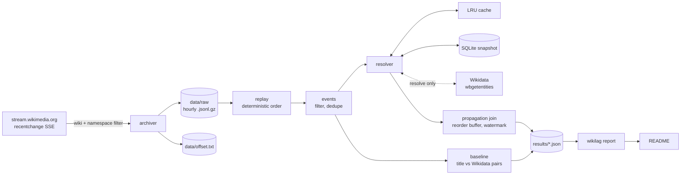

# wikilag

[](https://github.com/lawgalyadel/WikipediaLagChecker/actions/workflows/ci.yml)

Measures how long an edit about a subject takes to spread from one Wikipedia
language edition to the next. Edits come from Wikimedia's live `recentchange`
stream, and pages in different languages are matched through their shared
Wikidata item.

## Status

The whole pipeline is built and tested: archive, entity resolution, baseline,
propagation join, benchmark, failure analysis and report. Everything below
was measured on the current archive, which is a few hours long. Three things
are still pending, and each is marked where it appears:

- **Propagation lag numbers.** They need more than 12 hours of continuous
  archive (6h watermark plus 6h warm-up). Until then the join correctly
  reports nothing rather than numbers from windows it cannot see whole.
- **Precision and recall.** They need the 200 pairs in `labels/pairs.csv` to
  be labelled by hand.
- **The failure table.** It needs the review sheet from
  `wikilag failures sample` to be confirmed by hand.

## Results

Every number in this section is generated by `wikilag report` from
`results/*.json`, and each of those files is written by a run. Results that
don't exist yet show the command that produces them.

<!-- results:start -->

### Data

|  | Value |
|---|---|
| Archive window (event time, UTC) | 2026-09-13T14:58 → 2026-09-13T18:59 (5 hourly partitions) |
| Raw events archived | 60,072 |
| Undecodable archive lines | 0 (0.0000%) |
| Damaged gzip members recovered | 1 |
| Coverage gaps | 1 gap, 1 minute — largest: 1 min from 15:00 UTC 2026-09-13 |
| Article edits after filtering | 54,965 |
| Duplicates removed (restart re-archiving) | 66 |
| Filtered out | type:log 5,041 |

### Entity resolution

|  | Value |
|---|---|
| Edits resolved to a Wikidata item | 94.6% of 54,965 |
| **LRU cache hit rate** | **14.5%** (7,961 of 54,965 lookups; 545 were negative hits) |
| Coalesced within a block (repeat of a pending key) | 13.3% (7,303) |
| Served from the snapshot | 39,284 |
| Wikidata requests in this run | 21 batched requests for 417 titles |
| Request latency p50 / p95 | 288.4 ms / 694.6 ms |
| Rate limited / retries / failed titles / API errors | 0 / 0 / 0 / 0 |
| Cache capacity / evictions | 50,000 / 0 |

Hit rate counts only the in-memory LRU. Keys first seen in the same block are merged into one lookup and counted separately as coalesced.

### Baseline: title matching vs Wikidata

|  | Title match (naive) | Wikidata sitelinks |
|---|---|---|
| Cross-edition pairs found | 678 | 1,886 |
| Precision | _not measured yet — run `wikilag pairs evaluate`_ (needs labels) | _not measured yet — run `wikilag pairs evaluate`_ (needs labels) |
| Pooled recall (upper bound) | _not measured yet — run `wikilag pairs evaluate`_ (needs labels) | _not measured yet — run `wikilag pairs evaluate`_ (needs labels) |

Over 28,553 edited pages (95.3% with an item). Found by both: 666; title match only: 12; Wikidata only: 1,220.

**True pairs title matching misses:** 1,220 pairs are found only by Wikidata; how many are true awaits the labels.

Labels: 0 of 200 sampled pairs (stratified 94 / 12 / 94, seed 20260913), blind sheet in `labels/pairs.csv`.

### Propagation

**No propagation numbers yet.** Every item window either opened inside the warm-up or had not closed when the archive ended, so no lag, rank or late-follow-up figure can be stated. A first result needs more than 12h 00m of continuous archive.

Watermark 6h 00m, warm-up 6h 00m, reorder buffer 2m 00s. Windows opened: 36,444; excluded by warm-up: 36,444; still open at the end: 36,444.

### Performance

Replay of 5 partitions, median of 3 runs, on 10 physical / 12 logical cores. Output identical at every worker count: yes. Peak RSS under replay: **285.1 MB** (main process plus workers).

| Stage | Workers | Events/s | Speed-up | Efficiency | Peak RSS |
|---|---|---|---|---|---|
| full pipeline | 1 | 13,232 | 1.00× | 100% | 94.2 MB |
| full pipeline | 2 | 20,644 | 1.56× | 78% | 195.6 MB |
| full pipeline | 4 | 22,180 | 1.68× | 42% | 285.1 MB |
| parse only | 1 | 33,465 | 1.00× | 100% | 59.8 MB |
| parse only | 2 | 28,423 | 0.85× | 42% | 163.1 MB |
| parse only | 4 | 40,539 | 1.21× | 30% | 263.7 MB |

#### Profiled bottleneck: before and after

| Workers | Before (events/s) | After (events/s) | Gain | Scaling vs 1 worker |
|---|---|---|---|---|
| 1 | 5,986 | 13,232 | 2.21× | 1.00× → 1.00× |
| 2 | 7,067 | 20,644 | 2.92× | 1.18× → 1.56× |
| 4 | 7,088 | 22,180 | 3.13× | 1.18× → 1.68× |

Profile before: `~:0(<method 'execute' of 'sqlite3.Connection' objects>)` took 44.4% of a 11s profiled replay (39,702 calls). After: the top entry is `decoder.py:351(raw_decode)` at 21.2%, and the profiled replay takes 4s.

### Failure analysis

_not measured yet — run `wikilag failures sample`_

<sub>Generated by `wikilag report` from `results/*.json`. Runs: `archive` (b4598ce180e7), `resolve` (28bfcb037fe9), `pairs` (24aae2c8cca0), `propagation` (4efff4c8f63f), `bench_before` (5fd9fad6db57), `bench_after` (1064e2f0a5ae), `profile_before` (ca7fb1e27b57), `profile_after` (37d6c47bed2d).</sub>

<!-- results:end -->

## How it works



- **Capture** (`archiver.py`) does as little as possible: it drops wikis and
  namespaces outside the config and writes raw payloads to hourly gzip files.
  A bug in interpretation at capture time destroys data for good. The same
  bug at analysis time costs one replay.
- **Replay** (`replay.py`) reads partitions in sorted order and lines in file
  order. **Events** (`events.py`) is the only place raw payloads are
  interpreted.
- **Resolution** (`resolver.py`) maps `(wiki, title)` to a Wikidata item, in
  three tiers: an in-memory LRU cache, a SQLite snapshot, then batched API
  requests.
- **The join** (`propagation.py`) opens a window on an item's first edit. It
  records when the 2nd, 3rd and 5th editions arrive, and closes the window at
  the watermark.

## Design decisions

**The offset is saved only after the data it covers is on disk.** Gzip keeps
output in memory until flushed. If the offset moved ahead of the flushed data,
a crash would lose events and resume would skip past them. A hard kill now
re-archives up to `flush_every_events` events instead, and deduplication by
`meta.id` removes the copies.

**Replays read the resolution snapshot, not Wikidata.** Wikidata changes over
time, so resolving live would make results depend on the day they were run.
`resolve` fetches missing keys into SQLite. Every analysis reads that snapshot
offline, and the same archive gives byte-identical output.

**Negative results are cached.** About 5% of edited pages have no Wikidata
item. Without caching "no item", every edit to such a page would cost a
request.

**Arrival order isn't trusted.** Edits arrive up to ~50s out of order. A
reorder buffer puts them back in edit-time order. Anything later than the
buffer allows is counted, not silently misordered.

**Warm-up windows are excluded.** A window opening near the start of the
archive may have had earlier edits that were never captured, so its leader
can't be known. These windows emit nothing, and their count is reported.

**A late follow-up doesn't reopen the window.** Otherwise an edition arriving
after the watermark would become a leader of an item that was already
propagating.

**Leadership is corrected for volume.** English Wikipedia leads more often
mostly because it is edited more. Each edition's lead rate is therefore
reported next to the rate expected by chance, and the ratio between them
(lift).

**Baseline labels are blind and stratified.** The sheet doesn't show which
method found each pair. A uniform sample would be almost entirely pairs both
methods agree on, so pairs are sampled evenly from "both", "title only" and
"Wikidata only", then reweighted by group size.

**Parallelism is per partition, and the output is checked for identity.**
Parsing runs in worker processes. Deduplication, resolution and the join are
ordered and stateful, so they stay serial. The benchmark checks that every
worker count gives the same output hash.

## What didn't work

- **Offsets were saved ahead of the data.** The scaffold wrote the offset
  after every event, while gzip held up to an hour of output in memory. A
  hard kill in testing left an empty partition with an offset past it. Fixed
  by saving the offset only after a flush.
- **Replay crashed on killed partitions.** `gzip.open` raised on a file with
  no end-of-stream marker. The first fix handled damage only at the end of a
  file. After a restart, the damage sits mid-file, and that fix silently
  skipped the rest of the partition: it hid 15,582 of 19,994 events. It was
  caught by comparing the replay count with the archiver's own count. Each
  gzip member is now decoded on its own, with a resync at the next header.
- **Warm-up used the first edit to arrive, not the earliest.** An edit that
  arrived late but happened first could put a valid window into warm-up. A
  unit test caught it before it touched a result.
- **Per-key SQLite lookups.** The first profile put single-row `SELECT`s at
  47% of replay time, mostly statement overhead. Batching them into one query
  per 500 keys removed that cost.
- **The benchmark distorted its own profile.** Listing child processes on
  every memory sample walks the whole process table on Windows, which took
  21% of the first profile. The fix was to list children once, and to profile
  without the sampler.
- **Sampling pairs before resolution finished.** With 417 keys still
  unresolved, the "title match only" group held 22 pairs. After full
  resolution it held 12. Missing lookups inflate the naive method's apparent
  uniqueness, so pairs are sampled only after a complete `resolve`.
- **Redirects in batch lookups (not fixed).** `wbgetentities` doesn't follow
  redirects when given many titles, so an edit to a redirect title resolves
  to no item. See limitations.

## Limitations

- **Co-editing is not the same as news propagating.** Two editions editing
  the same item within the watermark count as propagation, even when both
  edits are routine upkeep. In a 60-record sample from a 1-hour-watermark
  sanity run, 17 were tiny edits on both sides and 12 were one person
  editing both editions. The failure analysis exists to size this.
- **The watermark shapes the headline.** Propagation slower than 6h is
  recorded as non-propagation. The share of items with a new edition after
  the window closed is reported next to it, but only within a 24h horizon.
- **Volume confounds leadership.** Lift corrects for how many editions share
  a window, not for why an edition is fast. A high lift can come from active
  editors as easily as from where the news broke.
- **Resolution limits.** Redirects are not followed, and title matching is
  exact. The snapshot is frozen when `resolve` runs, so sitelinks added
  afterwards are missing.
- **Recall is pooled.** It is measured against true pairs found by at least
  one method, so both recall figures are upper bounds. One person's labels
  have no agreement measure.
- **Edit time has one-second resolution.** Lag runs from each edition's
  first edit to an item, not from when specific content appeared.
- **Coverage.** There are 18 editions and namespace 0 only. Outages longer
  than the stream's replay history leave gaps; these are counted in the Data
  table.
- **Benchmark conditions.** A laptop running the archiver at the same time.
  Parse-stage throughput varied by up to 30% between identical runs, so only
  differences well beyond that are claimed.
- **Clean-machine Docker check.** The `docker compose up` quickstart has not
  yet been verified on a clean machine.

## Quickstart

```bash
docker compose up -d        # archiver runs until stopped, writes to ./data
```

Without Docker:

```bash
pip install -e ".[dev]"
python -m wikilag archive
```

## Reproducing the results

With an archive in `data/raw`, pick a window of complete partitions and run
these in order. Only `resolve` uses the network.

```bash
W="2026-09-13-1[4-8].jsonl.gz"
python -m wikilag stats            --partitions "$W"
python -m wikilag resolve          --partitions "$W"   # fills the snapshot
python -m wikilag pairs sample     --partitions "$W"   # then label labels/pairs.csv
python -m wikilag pairs evaluate
python -m wikilag join             --partitions "$W"
python -m wikilag failures sample  --partitions "$W"   # then review labels/failures.csv
python -m wikilag failures summarise
python -m wikilag profile          --partitions "$W" --label after
python -m wikilag bench            --partitions "$W" --label after
python -m wikilag report
```

All thresholds, paths, wiki lists and sample sizes live in
`config/default.toml`. Logs are JSON lines on stdout, each carrying a run id.
The ids in the report footer tie every table to its run.

## Layout

```
src/wikilag/
  archiver.py       stream -> hourly gzip partitions, flush-gated offsets
  replay.py         deterministic replay; damaged-member recovery; coverage gaps
  events.py         raw payloads -> typed edits; filters; bounded dedupe
  resolver.py       LRU cache, SQLite snapshot, batched Wikidata client
  pipeline.py       stage composition and result writing
  propagation.py    windowed join with reorder buffer and watermark
  analysis.py       lag percentiles; edition lead rate and lift
  pairs.py          title vs Wikidata pairs; stratified blind labelling
  failures.py       review sheet with evidence and suggested causes
  bench.py          scaling, peak RSS, profiling
  report.py         README results from results/*.json
results/            measured outputs (committed)
labels/             hand labels and review sheets (committed)
```
