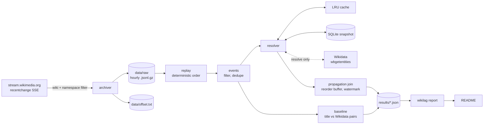

# wikilag

[](https://github.com/lawgalyadel/WikipediaLagChecker/actions/workflows/ci.yml)

Measures how long an edit about a subject takes to spread from one Wikipedia
language edition to the next. Edits come from Wikimedia's live `recentchange`
stream, and pages in different languages are matched through their shared
Wikidata item.

## Status

All the parts work and have tests: archiving, entity resolution, the
title-match baseline, the propagation join, benchmarking, failure analysis
and the report. The numbers below come from an archive that's only a few
hours long so far. Still to do:

- Propagation lag numbers. These need over 12 hours of continuous archive
  (6h watermark + 6h warm-up). Until then the join outputs nothing, instead
  of numbers from windows it only saw part of.
- Precision and recall. The 200 pairs in `labels/pairs.csv` need labelling
  by hand.
- The failure table. The review sheet from `wikilag failures sample` needs
  checking by hand.

## Results

This section is generated by `wikilag report` from the files in `results/`,
which the commands below write. Anything that hasn't been run yet shows the
command to run instead.

<!-- results:start -->

### Data

|  | Value |
|---|---|
| Archive window (event time, UTC) | 2026-09-13T14:58 → 2026-09-13T18:59 (5 hourly partitions) |
| Raw events archived | 60,072 |
| Undecodable archive lines | 0 (0.0000%) |
| Damaged gzip members recovered | 1 |
| Coverage gaps | 1 gap, 1 minute; largest: 1 min from 15:00 UTC 2026-09-13 |
| Article edits after filtering | 54,965 |
| Duplicates removed (restart re-archiving) | 66 |
| Filtered out | type:log 5,041 |

### Entity resolution

|  | Value |
|---|---|
| Edits resolved to a Wikidata item | 94.6% of 54,965 |
| **LRU cache hit rate** | **14.5%** (7,961 of 54,965 lookups; 545 were negative hits) |
| Coalesced within a block (repeat of a pending key) | 13.3% (7,303) |
| Served from the snapshot | 39,284 |
| Wikidata requests in this run | 21 batched requests for 417 titles |
| Request latency p50 / p95 | 288.4 ms / 694.6 ms |
| Rate limited / retries / failed titles / API errors | 0 / 0 / 0 / 0 |
| Cache capacity / evictions | 50,000 / 0 |

Hit rate counts only the in-memory LRU. Keys first seen in the same block are merged into one lookup and counted separately as coalesced.

### Baseline: title matching vs Wikidata

|  | Title match (naive) | Wikidata sitelinks |
|---|---|---|
| Cross-edition pairs found | 678 | 1,886 |
| Precision | _pending (run `wikilag pairs evaluate`)_ (needs labels) | _pending (run `wikilag pairs evaluate`)_ (needs labels) |
| Pooled recall (upper bound) | _pending (run `wikilag pairs evaluate`)_ (needs labels) | _pending (run `wikilag pairs evaluate`)_ (needs labels) |

Over 28,553 edited pages (95.3% with an item). Found by both: 666; title match only: 12; Wikidata only: 1,220.

**True pairs title matching misses:** 1,220 pairs are found only by Wikidata. How many are real won't be known until the sample is labelled.

Labels: 0 of 200 sampled pairs (stratified 94 / 12 / 94, seed 20260913), blind sheet in `labels/pairs.csv`.

### Propagation

No propagation numbers yet. Every window either opened during warm-up or was still open when the archive ended. The first results need more than 12h 00m of continuous archive.

Watermark 6h 00m, warm-up 6h 00m, reorder buffer 2m 00s. Windows opened: 36,444; excluded by warm-up: 36,444; still open at the end: 36,444.

### Performance

Replay of 5 partitions, median of 3 runs, on 10 physical / 12 logical cores. Output identical at every worker count: yes. Peak RSS under replay: **285.1 MB** (main process plus workers).

| Stage | Workers | Events/s | Speed-up | Efficiency | Peak RSS |
|---|---|---|---|---|---|
| full pipeline | 1 | 13,232 | 1.00× | 100% | 94.2 MB |
| full pipeline | 2 | 20,644 | 1.56× | 78% | 195.6 MB |
| full pipeline | 4 | 22,180 | 1.68× | 42% | 285.1 MB |
| parse only | 1 | 33,465 | 1.00× | 100% | 59.8 MB |
| parse only | 2 | 28,423 | 0.85× | 42% | 163.1 MB |
| parse only | 4 | 40,539 | 1.21× | 30% | 263.7 MB |

#### Profiled bottleneck: before and after

| Workers | Before (events/s) | After (events/s) | Gain | Scaling vs 1 worker |
|---|---|---|---|---|
| 1 | 5,986 | 13,232 | 2.21× | 1.00× → 1.00× |
| 2 | 7,067 | 20,644 | 2.92× | 1.18× → 1.56× |
| 4 | 7,088 | 22,180 | 3.13× | 1.18× → 1.68× |

Profile before: `~:0(<method 'execute' of 'sqlite3.Connection' objects>)` took 44.4% of a 11s profiled replay (39,702 calls). After: the top entry is `decoder.py:351(raw_decode)` at 21.2%, and the profiled replay takes 4s.

### Failure analysis

_pending (run `wikilag failures sample`)_

<sub>Generated by `wikilag report` from `results/*.json`. Runs: `archive` (b4598ce180e7), `resolve` (28bfcb037fe9), `pairs` (24aae2c8cca0), `propagation` (4efff4c8f63f), `bench_before` (5fd9fad6db57), `bench_after` (1064e2f0a5ae), `profile_before` (ca7fb1e27b57), `profile_after` (37d6c47bed2d).</sub>

<!-- results:end -->

## How it works



- `archiver.py` does as little as possible. It drops wikis and namespaces
  that aren't in the config and writes the raw payloads to hourly gzip files.
  Parsing happens later, so a parsing bug means re-running a replay instead
  of losing data.
- `replay.py` reads partitions in sorted order and lines in file order.
  `events.py` is the only place raw payloads get parsed.
- `resolver.py` maps `(wiki, title)` to a Wikidata item by checking an
  in-memory LRU cache, then a SQLite snapshot, then batched API requests.
- `propagation.py` opens a window on an item's first edit, records when the
  2nd, 3rd and 5th editions show up, and closes the window at the watermark.

## Design decisions

- The offset is only saved once the data it covers has been flushed to disk.
  Gzip buffers output in memory, so if the offset got ahead of the flushed
  data, a crash would lose events and the resume would skip them. A hard
  kill now re-archives up to `flush_every_events` events, and deduplication
  on `meta.id` removes the repeats.
- Replays read the resolution snapshot instead of calling Wikidata. Wikidata
  changes over time, so resolving live would make results depend on when
  they were run. `resolve` fetches missing keys into SQLite, the analyses
  read that snapshot offline, and the same archive always gives the same
  output.
- "No item" results are cached too. About 5% of edited pages have no
  Wikidata item, and without this every edit to one of them would cost a
  request.
- Arrival order isn't trusted. Edits can arrive up to ~50s out of order, so
  a reorder buffer puts them back in edit-time order. Anything later than
  the buffer allows is counted as out of order.
- Windows in the warm-up period are left out. A window that opens near the
  start of the archive may have had earlier edits that weren't captured, so
  its leader can't be known. Those windows produce no records, but they're
  counted.
- A late follow-up doesn't reopen a window. If it did, an edition arriving
  after the watermark would become the leader of an item that was already
  spreading.
- Lead rates are adjusted for volume. English Wikipedia leads more often
  mostly because it gets more edits, so each edition's lead rate is shown
  next to the rate expected by chance, plus the ratio between the two (lift).
- The labelling sheet is blind and stratified. It doesn't say which method
  found each pair. A uniform sample would be almost all pairs both methods
  agree on, so pairs are sampled evenly from "both", "title only" and
  "Wikidata only" and then reweighted by group size.
- Only parsing runs in parallel, one partition per worker process.
  Deduplication, resolution and the join depend on order and state, so they
  stay in the main process. The benchmark checks that every worker count
  gives the same output hash.

## What didn't work

- Offsets got saved ahead of the data. The first version wrote the offset
  after every event, while gzip could hold up to an hour of output in
  memory. Killing it during testing left an empty partition with an offset
  past it. Fixed by only saving the offset after a flush.
- Replay crashed on partitions from a killed archiver. `gzip.open` raises on
  a file with no end-of-stream marker. The first fix only handled damage at
  the end of a file, but after a restart the damage is in the middle, and
  that fix quietly skipped the rest of the partition (15,582 of 19,994
  events). Comparing the replay count with the archiver's own count caught
  it. Each gzip member is now decoded separately, resyncing at the next
  header.
- Warm-up used the first edit to arrive instead of the earliest. An edit
  that arrived late but happened first could push a valid window into
  warm-up. A unit test caught it before it affected any results.
- SQLite lookups one key at a time. The first profile had single-row
  `SELECT`s at 47% of replay time, mostly statement overhead. Batching 500
  keys per query fixed it.
- The benchmark slowed down the thing it was measuring. Listing child
  processes on every memory sample walks the whole process table on
  Windows, which was 21% of the first profile. Children are now listed
  once, and profiling runs without the memory sampler.
- Sampling pairs before resolution had finished. With 417 keys unresolved,
  the "title match only" group had 22 pairs; after resolving everything it
  had 12. Missing lookups make title matching look like it finds more pairs
  on its own than it really does, so pairs are only sampled after a full
  `resolve`.
- Redirects in batch lookups (still not fixed). `wbgetentities` doesn't
  follow redirects when given many titles, so an edit to a redirect page
  resolves to no item. See Limitations.

## Limitations

- Co-editing isn't the same as news spreading. Two editions editing the same
  item within the watermark counts as propagation, even if both edits are
  routine maintenance. In a 60-record sample from a test run with a 1-hour
  watermark, 17 were tiny edits on both sides and 12 were the same person
  editing both editions. The failure analysis is there to measure how
  common this is.
- The watermark affects the main result. Anything slower than 6h counts as
  not propagating. The share of items that got a new edition after the
  window closed is reported alongside, but only up to 24h.
- Volume still affects leadership. Lift adjusts for how many editions share
  a window, not for why an edition is fast. A high lift could come from
  active editors just as easily as from being where the news happened.
- Resolution. Redirects aren't followed and title matching is exact. The
  snapshot is frozen when `resolve` runs, so sitelinks added after that are
  missing.
- Recall is pooled. It's measured against true pairs found by at least one
  method, so both recall numbers are upper bounds. The labels come from one
  person, so there's no agreement score.
- Edit times are only accurate to the second. Lag is measured from each
  edition's first edit to an item, not from when specific content was added.
- Coverage. 18 editions, main namespace only. Outages longer than the
  stream's replay history leave gaps, which are counted in the Data table.
- Benchmark conditions. Run on a laptop with the archiver going at the same
  time. Parse-stage throughput varied by up to 30% between identical runs,
  so smaller differences than that don't mean much.
- The `docker compose up` quickstart hasn't been tested on a clean machine
  yet.

## Quickstart

```bash
docker compose up -d        # archiver runs until stopped, writes to ./data
```

Without Docker:

```bash
pip install -e ".[dev]"
python -m wikilag archive
```

## Reproducing the results

With an archive in `data/raw`, pick a window of complete partitions and run
these in order. Only `resolve` uses the network.

```bash
W="2026-09-13-1[4-8].jsonl.gz"
python -m wikilag stats            --partitions "$W"
python -m wikilag resolve          --partitions "$W"   # fills the snapshot
python -m wikilag pairs sample     --partitions "$W"   # then label labels/pairs.csv
python -m wikilag pairs evaluate
python -m wikilag join             --partitions "$W"
python -m wikilag failures sample  --partitions "$W"   # then review labels/failures.csv
python -m wikilag failures summarise
python -m wikilag profile          --partitions "$W" --label after
python -m wikilag bench            --partitions "$W" --label after
python -m wikilag report
```

Thresholds, paths, wiki lists and sample sizes are set in
`config/default.toml`. Logs are JSON lines on stdout with a run id on each
line, and the report footer lists the run that produced each result.

## Layout

```
src/wikilag/
  archiver.py       stream -> hourly gzip partitions, flush-gated offsets
  replay.py         deterministic replay; damaged-member recovery; coverage gaps
  events.py         raw payloads -> typed edits; filters; bounded dedupe
  resolver.py       LRU cache, SQLite snapshot, batched Wikidata client
  pipeline.py       stage composition and result writing
  propagation.py    windowed join with reorder buffer and watermark
  analysis.py       lag percentiles; edition lead rate and lift
  pairs.py          title vs Wikidata pairs; stratified blind labelling
  failures.py       review sheet with evidence and suggested causes
  bench.py          scaling, peak RSS, profiling
  report.py         README results from results/*.json
results/            measured outputs (committed)
labels/             hand labels and review sheets (committed)
```
